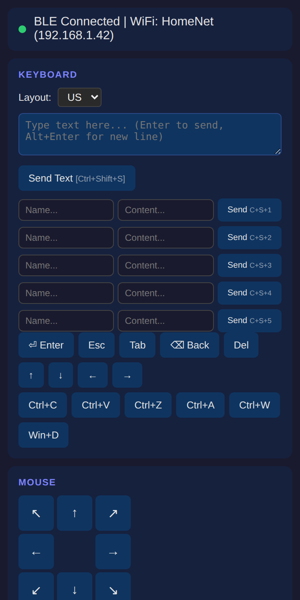
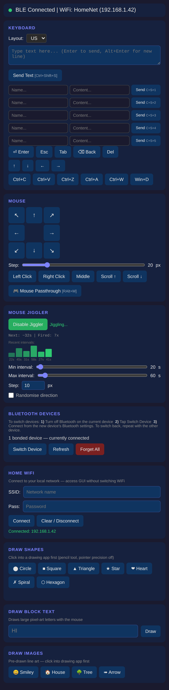

# Wireless HID

An **ESP32-C3** that acts as a Bluetooth Low Energy **keyboard + mouse**, controlled over WiFi from any browser. Hosts its own captive-portal access point *and* joins your home network, so you can drive the HID from a phone or laptop with no app to install.

<p align="center">
  
</p>

<details>
<summary><b>Full control panel screenshot</b></summary>

<p align="center">
  
</p>

</details>

## Features

- **BLE HID** (NimBLE) — types text, presses keys/combos, moves/clicks/scrolls the mouse on a paired device
- **Browser control** — served web UI at `http://hid.local` (or `192.168.4.1`), plus a REST endpoint and a low-latency WebSocket for mouse movement
- **Dual WiFi** — device AP (`Wireless-HID`) + connects to your home WiFi; captive portal auto-opens the config page
- **Mouse jiggler** — configurable min/max interval, step size, randomised direction, with history and count; runs in firmware independently of the browser
- **US / UK keyboard layouts**, switchable and persisted
- **BLE bond management** — list, rename, and forget paired devices
- All settings persisted to flash (NVS) via `Preferences`

## Hardware

- ESP32-C3 dev board (`esp32-c3-devkitm-1`)
- USB-C for power, flashing, and serial console

## Setup

This project keeps credentials out of source. Before building:

```bash
cp src/secrets.h.example src/secrets.h
# edit src/secrets.h and set your own AP_SSID / AP_PASS
```

`src/secrets.h` is gitignored and never committed. Your **home WiFi** credentials are *not* stored in source — you enter them at runtime through the web UI, and they live only in the device's NVS flash.

## Build & flash

Requires [PlatformIO](https://platformio.org/).

```bash
pio run              # compile
pio run -t upload    # flash over USB (esp-builtin, /dev/ttyACM0)
pio device monitor   # serial console @ 115200
```

## Command reference

Commands accepted over serial, `POST /cmd`, or the WebSocket:

| Command | Action |
|---|---|
| `TYPE <text>` | Type a string (`\n`, `\t` parsed) |
| `KEY <keycode>` | Press a raw HID keycode |
| `COMBO <mod> <key>` | Modifier bits + keycode (e.g. `COMBO 1 6` = Ctrl+C) |
| `MOVE <x> <y>` | Relative mouse move (-127..127) |
| `DRAG <x> <y>` | Move with left button held |
| `SCROLL <n>` | Scroll wheel |
| `CLICK <1\|2\|3>` | Click left/right/middle |
| `PRESS <1\|2\|3>` / `RELEASE` | Hold / release buttons |
| `STATUS` | Connection status |
| `LAYOUT US\|UK` | Set keyboard layout |
| `JIGGLE ON\|OFF` | Toggle jiggler |
| `JIGGLE MIN\|MAX <ms>` | Set jiggle interval bounds |
| `JIGGLE STEP <px>` | Set jiggle step size |
| `JIGGLE RAND <0\|1>` | Randomise jiggle direction |

## Project layout

```
platformio.ini        board + library config
src/
├── main.cpp          app: WiFi/AP, web server, WebSocket, jiggler
├── BleHid.h          NimBLE keyboard+mouse HID (header-only)
├── web_ui.h          embedded browser UI (PAGE_HTML)
├── secrets.h         AP credentials — gitignored, create from example
└── secrets.h.example template for secrets.h
```
